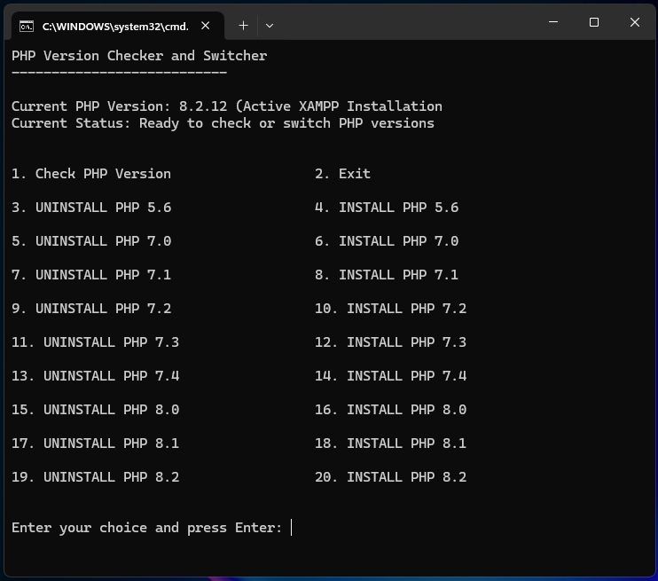

# PHP Version Switcher for XAMPP

A batch script to manage multiple PHP versions in XAMPP environment.

## How to Install

1. **Download the PHP Version Switcher:**
   - Clone the repository or download the batch script to your local machine.

2. **Place the Script:**
   - Ensure the script is placed in the directory where your XAMPP is installed.
   - Open `php-switcher.bat` using a text or code editor. Use the find and replace feature (Ctrl + H) to replace all instances of `D:\` with your actual XAMPP installation directory.
   - This will ensure the script paths align with your XAMPP directory structure.

3. **Run the Script:**
   - Execute the script by double-clicking on `php-switcher.bat` and enter your choice.

## How to Use

1. **Navigate the Menu:**
   - Upon running the script, you will be presented with a menu of options.

2. **Select an Option:**
   - Enter the number corresponding to the action you wish to perform (e.g., check PHP version, install/uninstall specific PHP versions).

3. **Follow the Prompts:**
   - The script will guide you through the process based on your selection.

## Supported PHP Versions
- PHP 5.6
- PHP 7.0
- PHP 7.1
- PHP 7.2
- PHP 7.3
- PHP 7.4
- PHP 8.0
- PHP 8.1
- PHP 8.2

## Component Compatibility

### phpMyAdmin Versions
- **phpMyAdmin 5.2.1**
  - Compatible with PHP versions: 7.2, 7.3, 7.4, 8.0, 8.1, 8.2

- **phpMyAdmin 4.9.2**
  - Compatible with PHP versions: 5.6, 7.0, 7.1

### Database
- **MariaDB 10.4.32**
  - Compatible with all PHP versions (5.6 to 8.2)